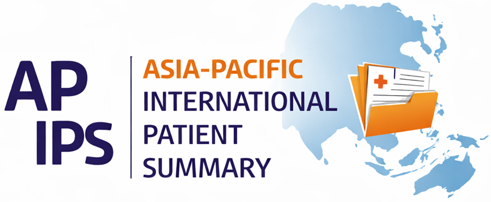

# Asia Pacific International Patient Summary (AP IPS)
### Advancing Cross-Border Healthcare Interoperability in the Asia-Pacific Region

The alliance of Asia Pacific International Patient Summary (AP-IPS) is an international collaborative initiative dedicated to promoting the adoption, implementation, and testing of the Fast Healthcare Interoperability Resources (FHIR) International Patient Summary (IPS).

AP-IPS brings together national IHE organizations, HL7 organizations, standards experts, healthcare institutions, and industry partners to address real-world interoperability challenges and accelerate digital health transformation.

AP-IPS promotes a continuous and iterative interoperability lifecycle:

## Video 
* Those videos were created by NotebookLM. 
 
###  FHIR IPS: Your Health History, Unlocked 
<iframe width="560" height="315" src="https://www.youtube.com/embed/5gO8gKLLZFQ" title="FHIR IPS: Your Health History, Unlocked" frameborder="0" allow="accelerometer; autoplay; clipboard-write; encrypted-media; gyroscope; picture-in-picture; web-share" allowfullscreen></iframe>

### FHIR IPS 国際健康パスポート：ボーダレスな医療情報 (日本語)
<iframe width="560" height="315" src="https://youtu.be/QmX4x4HeDFM" title="FHIR IPS 国際健康パスポート：ボーダレスな医療情報" frameborder="0" allow="accelerometer; autoplay; clipboard-write; encrypted-media; gyroscope; picture-in-picture; web-share" allowfullscreen></iframe>

### FHIR IPS국제건강여권: 국경없는의료정보 (한국어)
<iframe width="560" height="315" src="https://www.youtube.com/embed/u6U3IhGYfr0" title="FHIR IPS국제건강여권: 국경없는의료정보" frameborder="0" allow="accelerometer; autoplay; clipboard-write; encrypted-media; gyroscope; picture-in-picture; web-share" allowfullscreen></iframe>

### FHIR IPS國際健康護照：無國界醫療數據 (繁體中文)
<iframe width="560" height="315" src="https://www.youtube.com/embed/NR5ZjdnFjeY" title="FHIR IPS國際健康護照：無國界醫療數據" frameborder="0" allow="accelerometer; autoplay; clipboard-write; encrypted-media; gyroscope; picture-in-picture; web-share" allowfullscreen></iframe>

### 你的醫療保健準備好迎接一個無國界的世界了嗎? (繁體中文) 
<iframe width="560" height="315" src="https://www.youtube.com/embed/tMd9qNO4c4E" title="你的醫療保健準備好迎接一個無國界的世界了嗎?" frameborder="0" allow="accelerometer; autoplay; clipboard-write; encrypted-media; gyroscope; picture-in-picture; web-share" allowfullscreen></iframe>

## Standards → Implementation → Connectathon → Validation

