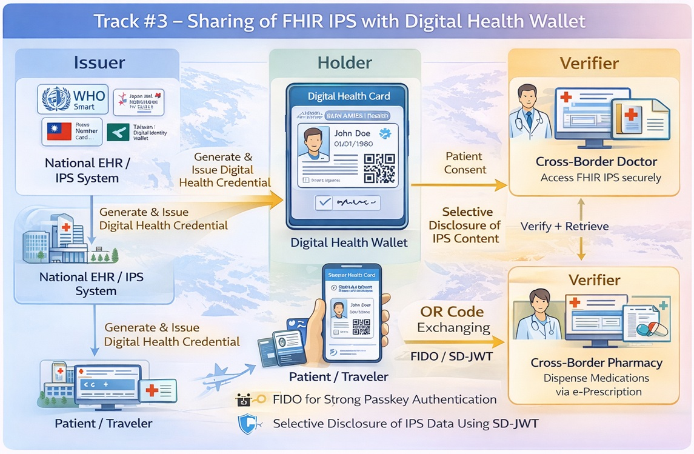

# Profile #3: IPS Digital Health Wallet Profile (IPS-DHW)

This profile enables patient-mediated exchange of FHIR IPS integrated with digital signatures, verifiable credentials, and digital health wallet technologies. The FHIR IPS document is packaged as a cryptographically verifiable and portable credential, allowing patients to securely carry, present, and share their health summaries across borders and healthcare systems.

The IPS-DHW Profile leverages emerging international initiatives and national digital identity infrastructures, including:

- WHO Smart Health Cards (SHC)
- Japan My Number Card
- Taiwan Digital Identity Wallet
- Other national or regional digital wallet platforms

FHIR IPS data is exchanged using QR codes or secure digital channels, with access strictly governed by explicit patient consent. Selective Disclosure JWT (SD-JWT) is used to enable privacy-preserving partial disclosure of IPS sections.

## 3.1 IPS-DHW Actors, Transactions, and Content Modules

This section defines the actors and transactions of the IPS-DHW Profile. To claim compliance with this profile, an actor shall support all required transactions (labeled "R") and may support the optional transactions (labeled "O").

**Table 3.1-1: IPS-DHW Profile – Actors and Transactions**

| Actor | Transaction | Optionality | Reference |
|---|---|---|---|
| IPS Issuer | Issue IPS Credential [IPS-W1] | R | Section 3.W1 |
|  | Bind Patient Identity [IPS-W4] | O | Section 3.W4 |
| Health Wallet | Issue IPS Credential [IPS-W1] | R | Section 3.W1 |
|  | Present IPS Credential [IPS-W2] | R | Section 3.W2 |
| IPS Verifier | Present IPS Credential [IPS-W2] | R | Section 3.W2 |
|  | Verify IPS Credential [IPS-W3] | R | Section 3.W3 |

### 3.1.1 Actor Descriptions and Actor Profile Requirements

#### 3.1.1.1 IPS Issuer

The IPS Issuer packages a FHIR IPS document as a cryptographically signed verifiable credential and delivers it to the patient's Health Wallet via the Issue IPS Credential [IPS-W1] transaction. The IPS Issuer shall:

- Produce a valid FHIR IPS Bundle conforming to the requirements of the IPSE Profile (Profile #2).
- Sign the IPS credential using a recognized digital certificate or cryptographic key pair (e.g., RS256 or ES256 algorithms).
- Encode the signed IPS as an SD-JWT or W3C Verifiable Credential format.
- Deliver the IPS credential to the Health Wallet via a secure digital channel or QR code.
- Optionally bind the IPS credential to a national digital identity (Bind Patient Identity [IPS-W4] – see National Identity Binding Option, Section 3.2.2).

#### 3.1.1.2 Health Wallet

The Health Wallet stores, manages, and presents the patient's IPS credentials. It acts as the patient's agent for controlled disclosure of health data across healthcare encounters and borders. The Health Wallet shall:

- Receive and securely store IPS credentials issued by the IPS Issuer via Issue IPS Credential [IPS-W1].
- Present IPS credentials to IPS Verifiers upon patient authorization via Present IPS Credential [IPS-W2], using either a QR code or a secure digital channel.
- Support selective disclosure via SD-JWT, allowing the patient to share only the IPS sections requested by the IPS Verifier (see SD-JWT Option, Section 3.2.1).
- Protect stored credentials using device-level security mechanisms (e.g., secure enclave, biometric access control).

#### 3.1.1.3 IPS Verifier

The IPS Verifier receives and validates IPS credentials presented by patients via the Health Wallet, then retrieves the FHIR IPS content for clinical use. The IPS Verifier shall:

- Request and receive IPS credentials from the Health Wallet via Present IPS Credential [IPS-W2].
- Validate the digital signature of the IPS credential via Verify IPS Credential [IPS-W3].
- Verify the certificate chain against a trusted IPS Issuer registry.
- Enforce patient consent and selective disclosure policies (SD-JWT Option, Section 3.2.1).
- Parse and render the FHIR IPS Bundle for clinical use.
- Reject credentials with expired, revoked, or unverifiable signatures.

## 3.2 IPS-DHW Actor Options

Options that may be selected for each actor are listed in Table 3.2-1.

**Table 3.2-1: IPS-DHW – Actors and Options**

| Actor | Option | Reference |
|---|---|---|
| IPS Issuer | SD-JWT Option | Section 3.2.1 |
|  | National Identity Binding Option | Section 3.2.2 |
| Health Wallet | Offline QR Code Option | Section 3.2.3 |
|  | National Identity Binding Option | Section 3.2.2 |
| IPS Verifier | SD-JWT Option | Section 3.2.1 |

### 3.2.1 SD-JWT Option

Actors that support this option shall implement Selective Disclosure JWT (SD-JWT) for privacy-preserving partial disclosure of IPS sections. The IPS Issuer shall encode each IPS section as a selectively disclosable claim in the SD-JWT. The Health Wallet shall generate a presentation proof disclosing only the claims requested by the IPS Verifier. The IPS Verifier shall verify SD-JWT presentation proofs and process only the disclosed claims.

### 3.2.2 National Identity Binding Option

Actors that support this option shall bind IPS credentials to a national digital identity infrastructure (e.g., Japan My Number Card, Taiwan Digital Identity Wallet). The IPS Issuer (with this option) binds the IPS credential to a verified national identity via Bind Patient Identity [IPS-W4]. The Health Wallet (with this option) links stored IPS credentials to the patient's national digital identity for cross-border trust establishment. This binding establishes trusted identity assurance levels required for international health data exchange.

### 3.2.3 Offline QR Code Option

Health Wallets that support this option shall encode the IPS credential as a QR code that can be scanned in offline (no network connectivity) environments. The QR code shall contain the complete signed IPS credential or a verifiable reference to it. IPS Verifiers shall be capable of scanning and decoding such QR codes without requiring a live network connection, enabling scenarios such as emergency care and disaster response.

## 3.3 IPS-DHW Required Actor Groupings

An actor from this profile shall implement required transactions in addition to all transactions required for the grouped actor.

**Table 3.3-1: IPS-DHW Required Actor Groupings**

| IPS-DHW Actor | Actor to be grouped with | Reference |
|---|---|---|
| IPS Issuer | IPS Creator (IPSE Profile) | Profile #2, Section 2.1.1.1 |
| IPS Issuer | ATNA / Secure Node | ITI TF-1: ATNA |
| IPS Verifier | CT / Time Client | ITI TF-1: Consistent Time |

## 3.4 IPS-DHW Overview

### 3.4.1 Concepts

The IPS-DHW Profile shifts IPS exchange from system-to-system models toward a patient-centric interoperability paradigm. Key enabling technologies include:

- **W3C Verifiable Credentials (VC)**: A data model for cryptographically verifiable, tamper-evident digital credentials.
- **SD-JWT (Selective Disclosure JWT)**: A JWT-based mechanism that allows a credential holder to selectively disclose individual claims while maintaining cryptographic integrity.
- **WHO Smart Health Cards (SHC)**: An open standard for encoding health data as signed, compact QR codes.
- **Digital Health Wallet**: A patient-controlled application that stores, manages, and presents health credentials.
- **National Digital Identity**: Country-specific digital identity infrastructure (e.g., Japan My Number Card, Taiwan Digital Identity Wallet) that provides certified identity assurance levels for credential binding.

### 3.4.2 Use Cases

**Use Case 1 – Cross-Border Travel and Emergency Care**

A patient traveling abroad presents a QR code from their Health Wallet. The IPS Verifier scans the QR code, invokes Verify IPS Credential [IPS-W3] to validate the digital signature, and retrieves the FHIR IPS content after obtaining patient consent via Present IPS Credential [IPS-W2]. No prior system integration between the patient's home institution and the receiving provider is required.

**Use Case 2 – Patient-Controlled Selective Sharing**

Using the SD-JWT Option, a patient selectively discloses specific IPS sections (e.g., allergy list and current medications) while withholding other sensitive sections (e.g., mental health history). The Health Wallet generates a presentation proof containing only the requested claims. The IPS Verifier validates the proof and processes the disclosed content.

**Use Case 3 – Outpatient or Referral Visit**

Patients share their IPS credentials during first-time clinic visits without requiring pre-established system-to-system connectivity between healthcare institutions. The IPS credential, issued once by the IPS Issuer, is reused across multiple healthcare encounters.

**Use Case 4 – Public Health or Disaster Response**

Using the Offline QR Code Option, first responders and emergency care providers access patient IPS summaries via QR code scanning without network connectivity. The IPS Verifier validates the offline credential and retrieves the IPS content for immediate clinical use.

**Use Case 5 – Integration with National Digital Identity Systems**

Using the National Identity Binding Option, IPS credentials are bound to national identity wallets (e.g., Japan My Number Card, Taiwan Digital Identity Wallet) via Bind Patient Identity [IPS-W4]. This binding establishes trusted identity assurance for cross-border use and enables interoperability with national eHealth infrastructures.

### 3.4.3 Process Flow

The following describes the general process flow for patient-mediated IPS exchange:

1. The IPS Issuer (grouped with IPS Creator) creates a FHIR IPS Bundle conforming to the IPSE Profile (Profile #2) and packages it as a signed IPS credential.
2. The IPS Issuer delivers the IPS credential to the patient's Health Wallet via Issue IPS Credential [IPS-W1] (QR code or secure digital channel).
3. When the patient visits a healthcare provider, the patient authorizes the Health Wallet to present the IPS credential.
4. The Health Wallet presents the IPS credential to the IPS Verifier via Present IPS Credential [IPS-W2] (QR code scan or secure digital channel).
5. The IPS Verifier validates the credential signature and certificate chain via Verify IPS Credential [IPS-W3].
6. The IPS Verifier retrieves the FHIR IPS content and processes it for clinical use.

## 3.5 IPS-DHW Security Considerations

- All credential issuance and verification shall use asymmetric cryptographic signing algorithms (e.g., RS256, ES256). The "NONE" algorithm shall not be used.
- IPS Issuers shall maintain a publicly accessible key discovery endpoint (e.g., JWKS URI) to allow IPS Verifiers to retrieve signing key material.
- Health Wallets shall protect stored credentials using device-level security mechanisms such as secure enclave storage and biometric or PIN-based access control.
- IPS Verifiers shall validate the complete certificate chain against a trusted IPS Issuer registry before processing any IPS credential content.
- Explicit patient consent shall be obtained before any credential presentation. Consent records should be logged for audit purposes.
- SD-JWT nonce binding shall be used to prevent credential replay attacks.
- IPS credentials shall include an expiration claim (`exp`). IPS Verifiers shall reject expired credentials.

## 3.6 IPS-DHW Cross Profile Considerations

The IPS-DHW Profile requires the IPSE Profile (Profile #2) for IPS content creation and structure. The IPS-DHW Profile interoperates with the following external specifications and frameworks:

- **WHO Smart Health Cards (SHC)**: The Offline QR Code Option is designed to be compatible with the SHC encoding specification.
- **W3C Verifiable Credentials Data Model**: The SD-JWT Option aligns with the W3C VC Data Model for cross-ecosystem interoperability.
- **National Digital Identity Frameworks**: The National Identity Binding Option supports integration with country-specific identity infrastructures (My Number, Taiwan Digital ID, EU eID, and similar).
- **IHE ATNA Profile**: IPS Issuers shall audit credential issuance events. IPS Verifiers shall audit credential verification and IPS access events.
- **AP IPS Governance Models**: The IPS-DHW Profile is intended to harmonize with Asia-Pacific IPS governance frameworks and international regulatory requirements for cross-border health data sharing.

Future directions include deeper alignment with W3C Verifiable Credentials, broader adoption of SD-JWT and privacy-enhancing technologies, interoperability testing between health wallets and national identity wallets, and expansion to support additional FHIR-based health artifacts (e.g., immunization records, imaging summaries).

---

[← Back to Themes](/en/themes)
