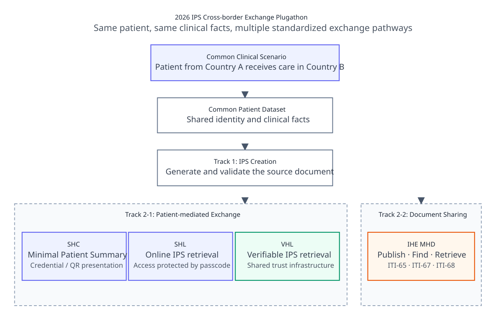
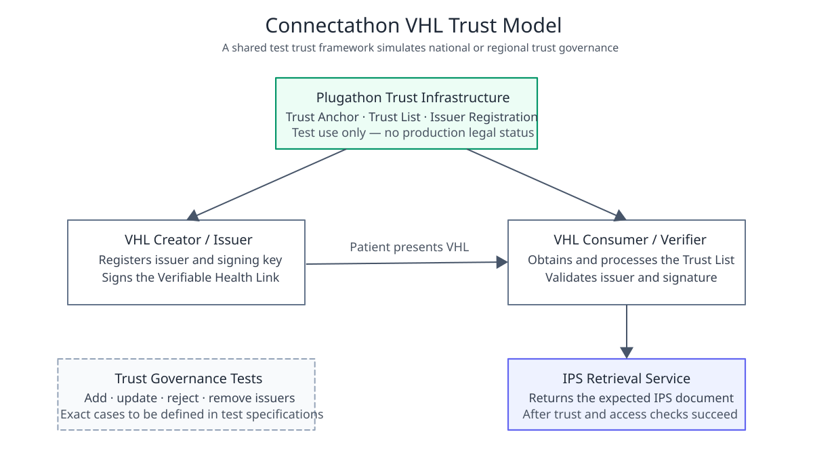
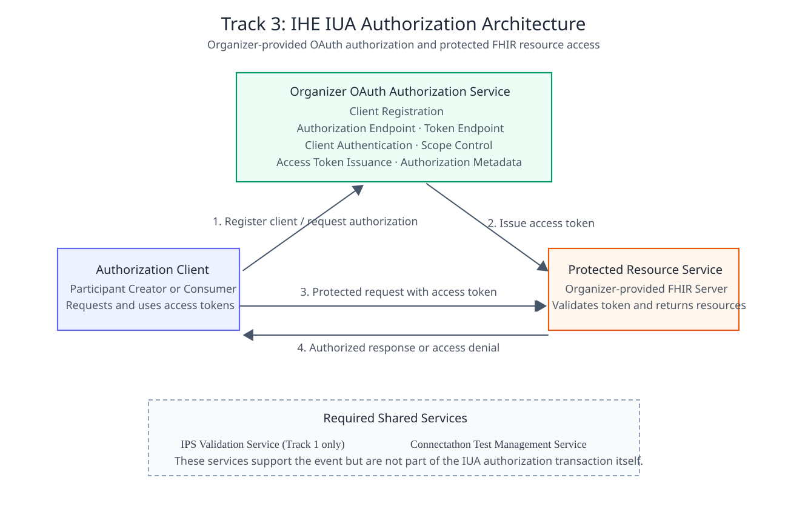
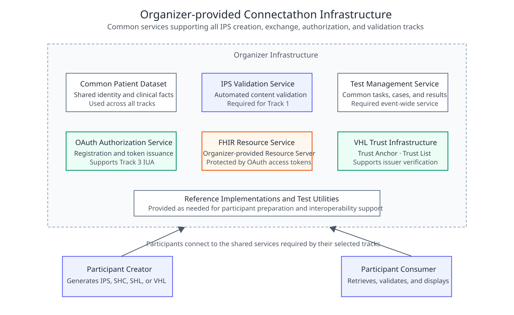
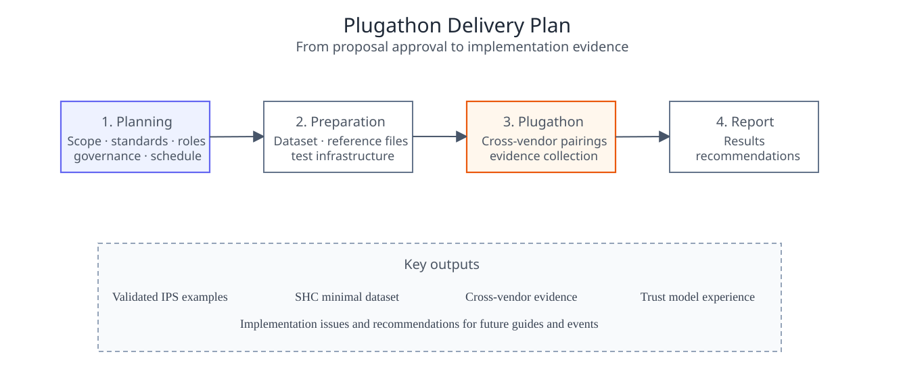
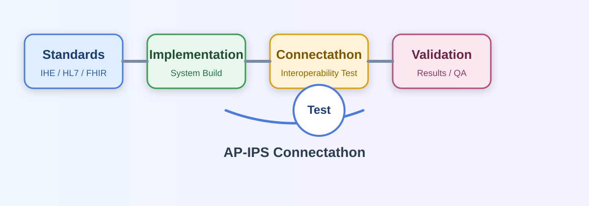
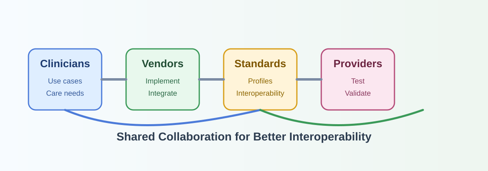

# Connectathon - Asia-Pacific Patient Summary v0.1.0

* [**Table of Contents**](toc.md)
* **Connectathon**

## Connectathon

# Connectathon and AP-IPS Plugathon

IHE Connectathons provide a structured, profile-driven testing environment where participants validate interoperability using IHE profiles and HL7 international standards. Within AP-IPS, Connectathon activities focus on cross-border IPS exchange scenarios, alignment of national FHIR implementation guides, and verification of real-world interoperability between systems from different countries.

The Asia-Pacific Patient Summary Plugathon extends this approach into a more focused implementation and validation event for cross-border patient summary exchange. The event combines an implementation guide style of interoperability testing with practical exchange scenarios for SMART Health Cards, SMART Health Links, Verifiable Health Links, IHE MHD, PDQm, IUA, and SMART App Launch.

## Objectives

* Validate standards conformance and interoperability.
* Identify gaps between specifications and real-world implementation.
* Strengthen regional alignment with international standards.
* Verify implementation readiness for patient summary exchange across borders.

## What Is a Connectathon?

Connectathon is a portmanteau of the words Connectivity and Marathon. It is an interoperability testing event conducted over several consecutive days, typically three to five days, during which participants meet face-to-face to test interoperability among their developed systems.

Participants implement systems based on specific profiles and clinical or operational scenarios. These profiles are typically structured by decomposing requirements into actors and transactions, where communication between actors is defined using open, internationally recognized standards such as HL7, DICOM, IEEE, OSI, and other international or industry-standard specifications.

## AP-IPS Plugathon Test Plan

### Purpose

This Plugathon defines the use cases, actors, exchange workflows, organizer-provided shared services, and conformance expectations for the Asia Pacific Patient Summary Plugathon.

It focuses on the questions of when, where, and how standardized exchange methods are used to complete verifiable interoperability behaviors. APIs, payloads, cardinalities, value sets, and Gazelle test definitions are expected to be specified in separate technical specifications or test-case documents.

### Background

The need for cross-border mobility, cross-institutional care, and patient-controlled health data management continues to grow. When patients seek care outside their original care organization or in another country, the receiving organization usually cannot directly access the complete medical record. A patient summary that can rapidly communicate essential clinical information and be understood consistently by different systems is therefore needed.

The International Patient Summary (IPS) provides an internationally harmonized patient-summary data model. In addition to the content model, the ability to generate, exchange, validate, and present an IPS securely, correctly, and effectively is essential to practical cross-border use.

The Plugathon validates the following capabilities:

* IPS document creation and content validation.
* Exchange of a concise patient summary using SMART Health Cards (SHC).
* Online IPS retrieval using SMART Health Links (SHL).
* Online IPS retrieval and trust validation using Verifiable Health Links (VHL).
* IHE MHD document provision, search, and retrieval.
* Access to RESTful/FHIR resources protected by IHE Internet User Authorization (IUA).
* Patient-mediated IPS access using SMART App Launch with standalone patient authorization and patient context.

### Scope

This document covers Plugathon scenarios, actors, workflows, organizer and participant responsibilities, conformance expectations, and success outcomes. It does not cover production clinical deployment, real patient data, legal validity, national-level PKI accreditation, clinical decision support, stress testing, or full EHR acceptance testing.

## Common Use Case

Figure 1. Overall Plugathon Design

### Common Clinical Scenario

A patient from Country A requires medical care while traveling in Country B. Before treatment, healthcare professionals in Country B need access to the patient summary to review demographics, allergies, current health problems, current medications, and other relevant information.

Patient-mediated exchange and document sharing are both in scope. The patient may hold a credential or link and choose when and with whom to share the health summary, while in document-sharing scenarios the summary is provided, searched, and retrieved through a document-sharing service.

### Common Patient Dataset

All Tracks SHALL use the same patient identity and the same core clinical facts so that different exchange methods can be compared under consistent conditions.

The common dataset SHOULD include:

* Patient demographics.
* Allergy information.
* Current health problems.
* Current medication information.
* Other IPS clinical content specified by the organizer.

SHL, VHL, and MHD generally exchange IPS documents validated in Track 1. Because of payload and QR code presentation constraints, SHC MAY use an organizer-defined IPS-informed Minimal Patient Summary and is not required to form a complete IPS Document Bundle.

### Exchange Model

The Plugathon workflow consists of five high-level stages:

1. Create: create an IPS document or Minimal Patient Summary.
2. Publish or Present: publish the document to a service or have the patient hold a Credential/Link.
3. Exchange: exchange data using SHC, SHL, VHL, MHD, or a FHIR API.
4. Validate: validate content, signatures, authorization, trust, and document consistency.
5. Use: the receiving system parses and presents the specified clinical information.

## Actors and Shared Services

### Clinical and Exchange Actors

* IPS Creator: creates an IPS document or concise patient summary.
* Patient: holds and presents a Credential or Link.
* IPS Consumer: obtains, validates, parses, and presents the patient summary.
* IPS Repository: receives, stores, searches, and returns IPS documents.
* Retrieval Service: provides document retrieval according to the SHL or VHL workflow.
* Authorization Client: obtains an Access Token from the Authorization Server and invokes a Resource.
* SMART Client: a participant-provided standalone application that performs SMART discovery, Authorization Code with PKCE, receives patient context, retrieves the authorized patient’s IPS, and presents the IPS content.
* Patient Demographics Consumer: queries the organizer-provided Patient Demographics Supplier to identify the assigned FHIR Patient before document publication.
* Patient Demographics Supplier: organizer-provided PDQm service that returns the test Patient resource corresponding to the assigned patient identity.

### Organizer-provided Shared Services

The organizer SHALL provide:

* Common patient dataset.
* Connectathon Test Management Service (for example, Gazelle).
* IPS validation service.
* IUA authorization server.
* SMART authorization server and preconfigured test patient accounts.
* PDQm patient demographics supplier.
* FHIR resource server.
* VHL trust infrastructure.

## Track Structure

### Track 1: IPS Creation and Content Validation

This Track focuses on IPS document creation and content validation. Participating systems SHALL use the common patient dataset and generate an exchangeable IPS Document Bundle according to the designated IPS Implementation Guide. Validated documents will serve as source documents for SHL, VHL, and MHD.

The expected scenario flow is:

* patient dataset available,
* IPS Creator generates the IPS bundle,
* validation service checks structure and content,
* validated document is reused by downstream exchange tracks.

Typical conformance requirements include: generation of a valid Bundle, valid Composition as first entry, resolution of internal references, and correction of validation errors before exchange.

### Track 2-1: Patient-mediated Exchange

This Track validates patient-controlled exchange using SMART Health Cards, SMART Health Links, and Verifiable Health Links.

* SHC verifies minimal patient summary issuance, credential validation, and parsing.
* SHL verifies link-based retrieval, passcode handling, and retrieval authorization.
* VHL verifies trust and signature validation in a shared trust environment.

### Track 2-2: IHE MHD with PDQm

This Track uses IHE MHD for IPS document sharing and includes ITI-65, ITI-67, and ITI-68. Before publishing an IPS document, the participating Document Source SHALL identify the organizer-assigned FHIR Patient using PDQm ITI-78. The Patient returned by PDQm is then used as the patient identity associated with the MHD document publication.

The typical workflow is:

* assign a test patient,
* use PDQm to resolve the FHIR Patient,
* publish the validated IPS using MHD,
* search and retrieve the patient document using DocumentReference queries.

### Track 3: Authorization and Patient-mediated FHIR Access

This Track focuses on secure access and patient-mediated retrieval using IHE IUA and SMART App Launch.

* IUA validates OAuth-based access token use for RESTful/FHIR resource access.
* SMART App Launch validates patient authentication, PKCE, patient context, authorized retrieval, and IPS presentation.

## Conformance and Evaluation

### Cross-implementation Requirement

Each exchange Track SHOULD complete at least one Creator/Consumer pairing between different implementers. Self-testing by a single implementer may be used for preparation but should not be the sole evidence of successful cross-system interoperability.

### Evidence

Test evidence MAY include:

* Automated validation results.
* Exchange records and required logs.
* Document Identifier and Metadata comparison results.
* Consumer presentation screenshots.
* Manual confirmation by a Monitor.

### Success Criteria

A scenario is considered successful when the participating system completes the required exchange workflow under the designated conditions, obtains the correct patient data, passes the required validation, and presents the specified clinical information.

## Plugathon Execution

### Preparation

The organizer SHALL publish the adopted specification versions, common data, roles, test environment, patient-account assignment, and registration method. Participants SHALL complete configuration of endpoints, keys, issuers, clients, redirect URIs, and required services.

### Event Execution

Participants perform cross-implementation testing according to scenarios assigned by the Test Management Service and submit the required evidence. A Monitor MAY assist in confirming results and documenting specification ambiguities.

### Post-event Review

The organizer SHOULD consolidate successful results, implementation issues, specification ambiguities, and environmental issues and use them to develop recommendations for subsequent revisions to the implementation guide, test cases, and tools.

## Expected Outputs

The expected outputs of this Plugathon are:

* A reusable cross-border IPS use case.
* A common patient dataset and validated IPS reference documents.
* A Plugathon specification for the SHC Minimal Patient Summary.
* Cross-implementation results for SHC, SHL, VHL, MHD, IHE IUA, and SMART App Launch.
* Operational experience with the shared VHL trust framework.
* Implementation issues and recommendations for specification revision.

## Benefits of Participation

### VHL Trust Model

Figure 2. Plugathon VHL Trust Model

Organizations participating in a Connectathon or Plugathon can:

* Validate whether their products conform to relevant standards.
* Test interoperability with systems from other vendors using real-world use cases.
* Rapidly identify and resolve technical integration and interface issues through close, collaborative problem-solving.

During the event, participants conduct live connection tests with other systems to verify compliance with international standards. Any non-conformant issues identified can often be corrected within a short timeframe. Connectathon testing environments support the validation of tens of thousands of transactions, and results are evaluated by neutral Connectathon monitors, who independently assess and confirm interoperability outcomes.

## After the Connectathon

Upon completion, results are published in a Connectathon Results Matrix, allowing stakeholders to review verified interoperability outcomes. Through Connectathon activities, industry participants foster data exchange, mutual collaboration, and cooperative development, ultimately enabling the creation of products with global market competitiveness.

### IHE IUA Authorization Architecture

Figure 3. IHE IUA Authorization Architecture

### Organizer-provided Infrastructure

Figure 4. Organizer-provided Plugathon Infrastructure

## Achieving Healthcare IT Interoperability Through Collaboration

To promote interoperability between healthcare IT users and vendors, the following key practices are essential:

* Clearly defining use cases.
* Identifying the information and processes required to support those use cases.
* Implementing information exchange using existing international standards.
* Participating in annual Connectathons to demonstrate system conformance.
* Encouraging close collaboration among care providers, IT professionals, and vendors to jointly define standards and common guidelines.

In this collaborative model, care providers contribute real-world clinical challenges, IT professionals and vendors develop standards-compliant solutions to address those needs, and healthcare organizations procure systems that conform to shared guidelines and interoperability requirements.

### Plugathon Delivery Plan

Figure 5. Plugathon Delivery Plan

  

  

