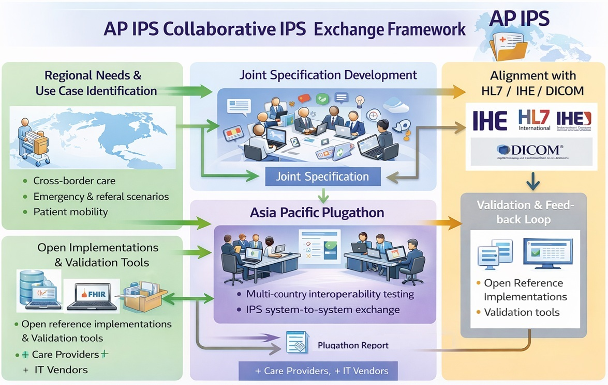

# Introduction - Asia-Pacific Patient Summary v0.1.0

* [**Table of Contents**](toc.md)
* **Introduction**

## Introduction

# Introduction

The Asia-Pacific Patient Summary was established to support international healthcare interoperability using FHIR IPS as a foundational use case.

## What This IG Provides

* A profile-oriented structure similar to IPS and IHE IG publications
* Technical content organized into Volume 1, Volume 2, and Volume 3
* Practical implementation references for Connectathon and Plugathon activities

## Introductory Topics

* [Overview](overview.md)
* [Green Button](green-button.md)
* [Digital Wallet](digital-wallet.md)
* [Patient Demographics Profile (IPD)](profile-ipd.md)
* [International Patient Summary Exchange Profile (IPSE)](profile-ipse.md)
* [IPS Digital Health Wallet Profile (IPS-DHW)](profile-ips-dhw.md)

