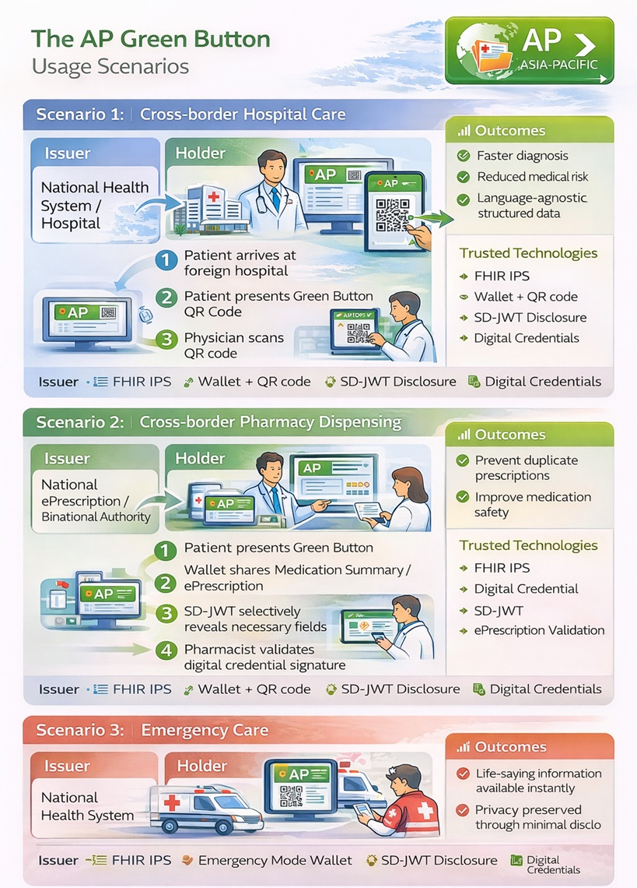

# Overview - Asia-Pacific Patient Summary v0.1.0

* [**Table of Contents**](toc.md)
* **Overview**

## Overview

# Overview

## Asia Pacific Green Button

### One Click, Your IPS, Anywhere in Asia-Pacific

The AP Green Button is a patient-centered, standards-based digital access mechanism that enables individuals to securely access, download, and share their IPS across the Asia-Pacific region.

It is designed to support trusted, cross-border health information exchange, empowering patients to authorize the use of their essential clinical data for care delivery, emergency treatment, and medication dispensing.

The AP Green Button aligns with international interoperability principles promoted by WHO, HL7 International, IHE, and regional digital health initiatives. It is a one-click mechanism that allows patients to:

* Download your IPS
* Store it in a Digital Health Wallet
* Share selected information via QR code or secure link
* Authorize access across countries, healthcare providers, and pharmacies

### Policy Statement

The AP Green Button promotes patient-mediated health information exchange by providing a simple, secure, and interoperable mechanism for individuals to access and share their IPS. By leveraging IPS, verifiable digital credentials, and selective disclosure technologies, the Green Button supports:

* Continuity of care across borders
* Emergency medical decision-making
* Safe medication reconciliation
* Patient trust and data sovereignty

The system is built on open standards and respects national digital identity frameworks, such as:

* WHO Smart Health Cards
* Japan My Number ecosystem
* Taiwan Digital Identity Wallet

There are three common scenarios of AP Green Button:

* Scenario 1: Cross-border Medical Care (Hospital)
* Scenario 2: Cross-border Pharmacy Dispensing
* Scenario 3: Emergency Care

## Available Profiles

### Profile #1: FHIR International Patient Demographics Profile (IPD)

Establishes cross-institutional and cross-border patient identity consistency via Master Patient Index (MPI) mechanisms. Enables different systems to share, synchronize, and update patient demographic data for accurate identification across international healthcare domains.

### Profile #2: FHIR International Patient Summary Exchange Profile (IPSE)

Supports cross-system exchange of patient summaries based on HL7 FHIR IPS Implementation Guide and IHE Mobile access to Health Documents (MHD) Profile. Enables secure sharing of key health information (allergies, medications, conditions, procedures, immunizations) across countries and healthcare organizations.

### Profile #3: IPS Digital Health Wallet Profile (IPS-DHW)

Enables patient-mediated exchange of FHIR IPS integrated with digital signatures, verifiable credentials, and digital health wallet technologies. FHIR IPS documents are packaged as cryptographically verifiable portable credentials using QR codes, W3C Verifiable Credentials, and Selective Disclosure JWT (SD-JWT), supporting privacy-preserving and patient-controlled data sharing across borders.

