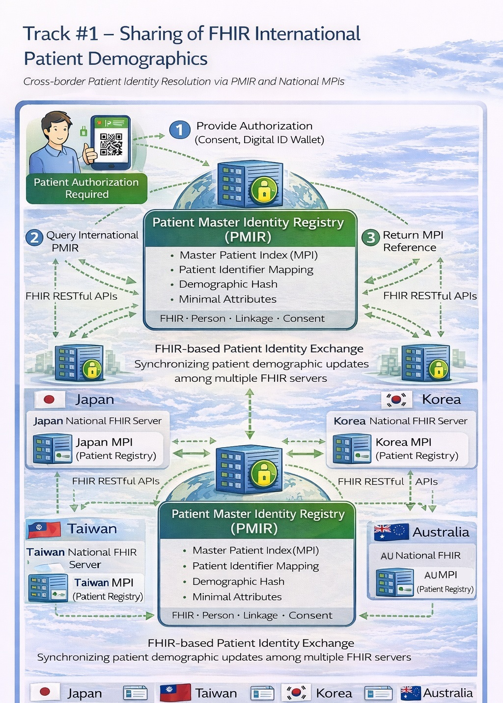

# Patient Demographics Profile (IPD) - Asia-Pacific Patient Summary v0.1.0

* [**Table of Contents**](toc.md)
* **Patient Demographics Profile (IPD)**

## Patient Demographics Profile (IPD)

# Profile #1: FHIR International Patient Demographics Profile (IPD)

This profile establishes cross-institutional and cross-border patient identity consistency through a Master Patient Index (MPI) mechanism, based on the IHE Patient Master Identity Registry (PMIR) Profile. It enables different systems to share, synchronize, and update patient demographic data (for example, name, date of birth, and identifiers), ensuring that individuals can be accurately identified across international healthcare domains.

## MHD-Style Chapter Pages

* [IPD Scope](profile-ipd-scope.md)
* [IPD Actors](profile-ipd-actors.md)
* [IPD Transactions](profile-ipd-transactions.md)
* [IPD Options](profile-ipd-options.md)
* [IPD Security](profile-ipd-security.md)
* [IPD Cross-Profile](profile-ipd-cross-profile.md)

## 1.1 IPD Actors, Transactions, and Content Modules

This section defines the actors and transactions in the IPD Profile. To claim compliance with this profile, an actor shall support all required transactions (labeled "R") and may support optional transactions (labeled "O").

| | | | |
| :--- | :--- | :--- | :--- |
| Patient Identity Source | Mobile Patient Identity Feed [ITI-93] | R | IHE PMIR ITI TF-2: 3.93 |
| Patient Identity Manager | Mobile Patient Identity Feed [ITI-93] | R | IHE PMIR ITI TF-2: 3.93 |
| Patient Identity Manager | Mobile Patient Identity Query [ITI-78] | R | IHE PDQm ITI TF-2: 3.78 |
| Patient Identity Manager | Subscribe to Patient Updates [ITI-94] | O | IHE PMIR ITI TF-2: 3.94 |
| Patient Identity Consumer | Mobile Patient Identity Query [ITI-78] | R | IHE PDQm ITI TF-2: 3.78 |
| Patient Identity Consumer | Subscribe to Patient Updates [ITI-94] | O | IHE PMIR ITI TF-2: 3.94 |

## 1.2 IPD Actor Options

| | | |
| :--- | :--- | :--- |
| Patient Identity Manager | Subscription Notification Option | Section 1.2.1 |
| Patient Identity Consumer | Subscription Notification Option | Section 1.2.1 |

Actors that support this option use Subscribe to Patient Updates [ITI-94] to receive real-time notifications when patient identity records are created, updated, or merged.

## 1.3 IPD Required Actor Groupings

| | | |
| :--- | :--- | :--- |
| Patient Identity Source | CT / Time Client | ITI TF-1: Consistent Time |
| Patient Identity Manager | CT / Time Client | ITI TF-1: Consistent Time |
| Patient Identity Manager | ATNA / Secure Node | ITI TF-1: ATNA |
| Patient Identity Consumer | IUA / Authorization Client | ITI TF-1: IUA |

## 1.4 IPD Overview

The IPD Profile enables cross-border patient identity federation by establishing a common mechanism to share, synchronize, and update patient demographic data across different healthcare domains using FHIR-based APIs.

### Key concepts

* Patient Identity: Demographic attributes used to uniquely identify an individual across systems.
* Identity Federation: Correlating patient identities across organizations and national systems.
* MPI (Master Patient Index): Registry that maintains authoritative patient identity records.
* Golden Record: Authoritative merged identity record maintained by the Patient Identity Manager.

### Representative use cases

* Cross-border identity synchronization.
* Patient identity query using partial demographics.
* Identity conflict resolution and notification propagation.

## 1.5 IPD Security Considerations

All transactions shall be secured using TLS compliant with BCP195. Patient demographic data is personally identifiable information (PII) and shall be protected according to applicable national privacy regulations. The Patient Identity Manager shall audit identity feed and query transactions according to IHE ATNA requirements.

## 1.6 IPD Cross Profile Considerations

The IPD Profile provides the foundational patient identity layer for the IPSE Profile (Profile #2). Patient identity resolution via IPD must be established before IPS documents can be securely exchanged across borders.

