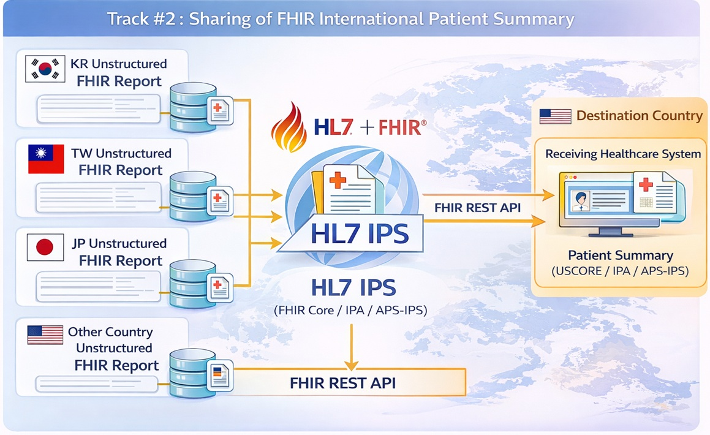

# International Patient Summary Exchange Profile (IPSE) - Asia-Pacific Patient Summary v0.1.0

* [**Table of Contents**](toc.md)
* **International Patient Summary Exchange Profile (IPSE)**

## International Patient Summary Exchange Profile (IPSE)

# Profile #2: FHIR International Patient Summary Exchange Profile (IPSE)

This profile supports cross-system exchange of patient summaries based on the HL7 FHIR International Patient Summary (IPS) Implementation Guide and IHE Mobile access to Health Documents (MHD) Profile. It enables secure sharing of key health information, such as allergies, medications, conditions, procedures, and immunizations, across countries and healthcare organizations.

## MHD-Style Chapter Pages

* [IPSE Scope](profile-ipse-scope.md)
* [IPSE Actors](profile-ipse-actors.md)
* [IPSE Transactions](profile-ipse-transactions.md)
* [IPSE Options](profile-ipse-options.md)
* [IPSE Security](profile-ipse-security.md)
* [IPSE Cross-Profile](profile-ipse-cross-profile.md)

## 2.1 IPSE Actors, Transactions, and Content Modules

The IPSE Profile supports two complementary methods for IPS exchange: IHE Transactions (MHD-based) and FHIR API (RESTful).

### Approach 1: IHE MHD Transactions

| | | | |
| :--- | :--- | :--- | :--- |
| IPS Creator | Provide IPS Document Bundle [ITI-65] | R | IHE MHD ITI TF-2: 3.65 |
| IPS Repository | Provide IPS Document Bundle [ITI-65] | R | IHE MHD ITI TF-2: 3.65 |
| IPS Repository | Find IPS Document References [ITI-67] | R | IHE MHD ITI TF-2: 3.67 |
| IPS Repository | Retrieve IPS Document [ITI-68] | R | IHE MHD ITI TF-2: 3.68 |
| IPS Consumer | Find IPS Document References [ITI-67] | R | IHE MHD ITI TF-2: 3.67 |
| IPS Consumer | Retrieve IPS Document [ITI-68] | R | IHE MHD ITI TF-2: 3.68 |
| Terminology Server | Concept Map Translate [ITI-SVCM] | O | IHE SVCM |

### Approach 2: FHIR RESTful API

| | | | |
| :--- | :--- | :--- | :--- |
| IPS Creator | Create IPS Bundle (POST /Bundle) | R | FHIR Document Resource |
| IPS Creator | Update IPS Composition (PUT /Composition/{id}) | O | FHIR Composition Resource |
| IPS Repository | Create/Store IPS Bundle (POST /Bundle) | R | FHIR Document Resource |
| IPS Repository | Search DocumentReference (GET search) | R | FHIR DocumentReference Search |
| IPS Repository | Retrieve IPS Bundle (GET /Bundle/{id}) | R | FHIR Bundle Resource |
| IPS Repository | Update IPS Metadata (PUT /DocumentReference/{id}) | O | FHIR DocumentReference Resource |
| IPS Consumer | Search Document References (GET /DocumentReference search) | R | FHIR Search |
| IPS Consumer | Retrieve IPS Bundle (GET /Bundle/{id}) | R | FHIR Bundle Resource |
| IPS Consumer | Read Composition (GET /Composition/{id}) | R | FHIR Composition Resource |
| Terminology Server | Concept Map Translate (POST /ConceptMap/$translate) | O | FHIR ConceptMap Operation |

## 2.2 IPSE Actor Options

* Laboratory Report Option
* Pathology Report Option
* Radiology Report with Imaging Option
* Terminology Mapping Option (SVCM)
* Rendering Option
* API Binding Option (FHIR RESTful)

## 2.3 IPSE Required Actor Groupings

| | | |
| :--- | :--- | :--- |
| IPS Creator | CT / Time Client | ITI TF-1: Consistent Time |
| IPS Repository | CT / Time Client | ITI TF-1: Consistent Time |
| IPS Repository | ATNA / Secure Node | ITI TF-1: ATNA |
| IPS Consumer | IUA / Authorization Client | ITI TF-1: IUA |

## 2.4 IPSE Overview

The IPSE Profile establishes a standardized framework for cross-border exchange of health summaries using FHIR Bundle documents.

### Representative use cases

* Basic IPS sharing (Minimal IPS).
* Advanced IPS sharing (Expanded IPS with optional diagnostic report types).
* IPS retrieval and rendering, with optional SVCM terminology mapping.

## 2.5 IPSE Security Considerations

All transactions shall be secured using TLS compliant with BCP195. IPS documents contain protected health information (PHI), and access control shall be enforced at the IPS Repository. OAuth 2.0 based authorization is expected for API access, including SMART on FHIR or IHE IUA aligned approaches.

## 2.6 IPSE Cross Profile Considerations

The IPSE Profile depends on the IPD Profile (Profile #1) for patient identity resolution prior to IPS exchange. The IPSE Profile may be extended by the IPS-DHW Profile (Profile #3) for patient-mediated verifiable-credential-based sharing.

