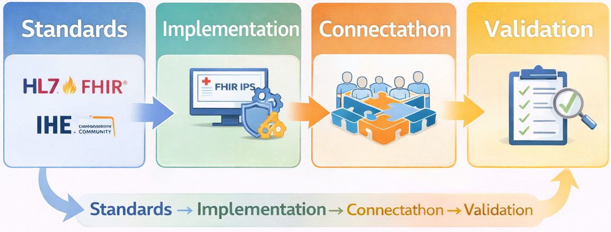
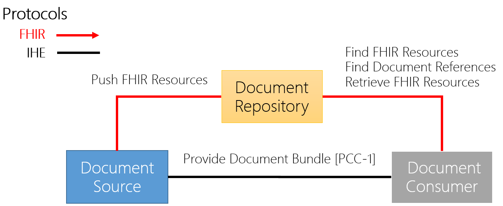
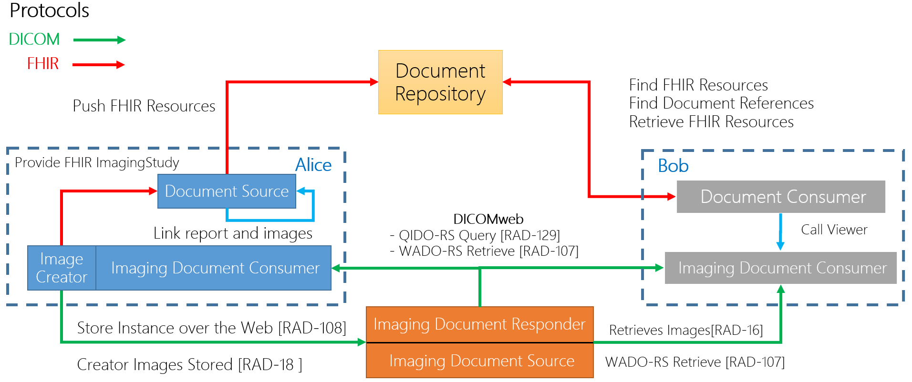

# Examples - Asia-Pacific Patient Summary v0.1.0

* [**Table of Contents**](toc.md)
* **Examples**

## Examples

# Volume 3: Examples

This section summarizes Asia-Pacific Patient Summary example scenarios and supporting diagrams.

## Scenario Set

* Track 1: FHIR International Patient Demographics (IPD)
* Track 2: FHIR International Patient Summary Exchange (IPSE)
* Track 3: IPS with Digital Health Wallet (IPS-DHW)

## Diagram Examples

