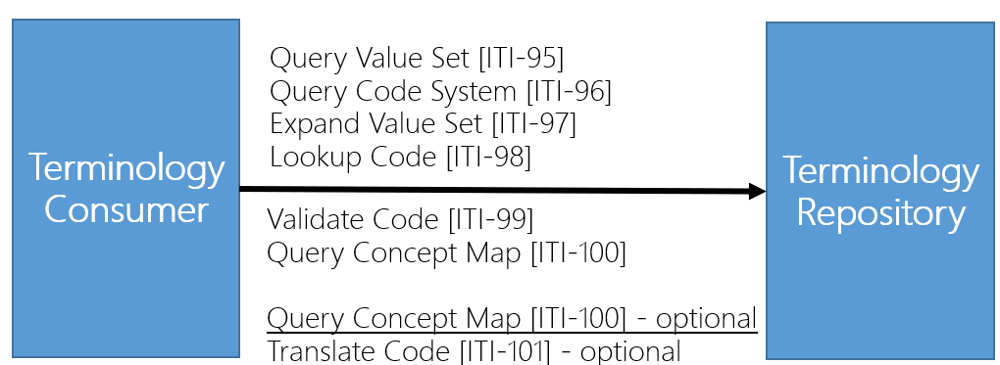

# Terminology - Asia-Pacific Patient Summary v0.1.0

* [**Table of Contents**](toc.md)
* **Terminology**

## Terminology

# Volume 3: Terminology

Asia-Pacific Patient Summary terminology strategy supports shared semantics across regional implementations.

## Terminology Focus

* LOINC, SNOMED CT, ICD-family, and national code systems
* ConceptMap-based translation and localization
* Optional runtime mapping with ITI-SVCM or FHIR ConceptMap operations

## Implementation Notes

* Preserve source coding for traceability
* Provide mapped display values where needed for local workflows
* Validate value set bindings during profile conformance testing

